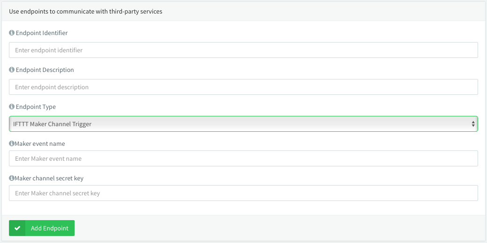

# Server-Endpoints

This repository contains all the endpoint templates that can be loaded in a Thinger.io server instance to execute endpoint calls by devices. A template is basically a definition of a HTTP call where some parameters are modified in runtime by the server, i.e., for setting credentials in headers, modifying URLs, and so on.  

To load the endpoints in a Thinger.io server instance, just access a shell where the MongoDB server instance is running, and where the command `mongoimport` exists. Then, execute the script `import_script.sh` that will load all the JSON templates definitions in the database.

**Note**: The import script just try to import the endpoints in the local `thinger` database. If you are using a custom database name, you may need to modify the script.


```bash
git clone https://github.com/thinger-io/Server-Endpoints
cd Server-Endpoints
./import_script.sh
```

A Thinger.io endpoint template is defined as the following example (for calling the IFTTT Maker Channel Trigger).


```json
{
    "_id" : "ifttt_maker_trigger",
    "name" : "IFTTT Maker Channel Trigger",
    "type" : "http_request",
    "description" : "....",
    "http_request" : {
        "url" : "https://maker.ifttt.com/trigger/{{event}}/with/key/{{key}}",
        "body_type" : "json",
        "headers" : [],
        "method" : "POST"
    },
    "parameters" : [ 
        {
            "id" : "event",
            "name" : "Maker event name",
            "description" : "The name of the event you have entered in the IFTTT Maker Channel while configuring the trigger channel, like \"button_pressed\" or \"front_door_opened\"."
        }, 
        {
            "id" : "key",
            "name" : "Maker channel secret key",
            "description" : "Your IFTTT Maker Channel secret key that will allow call your defined Maker events."
        }
    ]
}
```

The console then processes this template and provides an interface for esasily configuring the endpoint, like the required credentials:

<p align="center">

</p>


